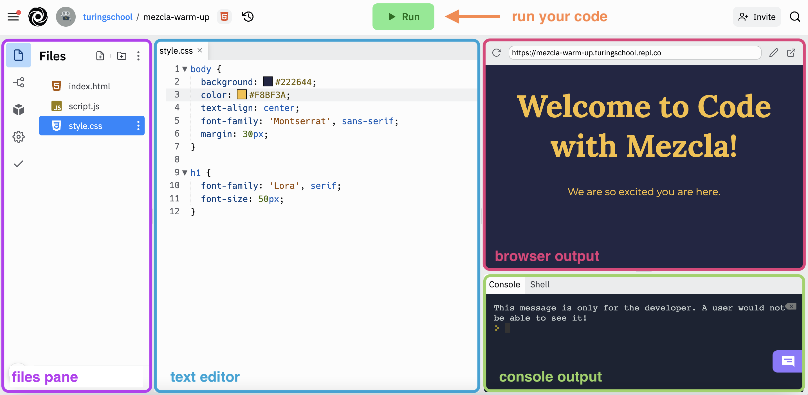

# Welcome to Code With Mezcla

Visit:

`https://try.turing.edu/mezcla/`

and follow the sections in the Welcome section to get set up.

---

# Goals

- Build and customize an [interactive website](https://mezcla-checkpoint-3.turingschool.repl.co)
- Gain _exposure_ and familiarity with some HTML, CSS, and JavaScript
- Determine if coding is something you enjoy doing and want to pursue further
- Meet other Latin@s working in tech and curious about tech

---

# What to Expect

- Welcome and Setup (1 hour)
- Instruction (2 hours and 30 minutes)
- Lunch Sessions (1 hour)
- Group Challenge (1 hour and 30 minutes)
- Presentations and Wrap-Up (1 hour)

12:30 MT as a hard-ish stop for the morning.

---

# Online Learning Norms

- Ask your questions and share your code!
- Mute your microphone unless you’re the main speaker.
- Keep your camera on during class.
- Disconnected? Jump back on! The host or TA will resume the session shortly.


---

# Asking Questions

Want to get my attention during the workshop?

* Raise your hand
* Type your question in the chat
* Come off mute and ask!

---

# Replit.com



---

# Warm-Up Activity

See Mezcla site for a scavenger hunt!

---

# Share Out!

* **Zoom Chat**
* **Raise Hand**

---

# BREAK

---

# Breakout Introductions

In alphabetical order by first name, please share:

* Your name
* Your pronouns
* Your location
* Why did you decide to join this workshop today?

---

# Overview Reminder

- Welcome and Setup (1 hour)
- Instruction (2 hours and 30 minutes)
- Lunch Sessions (1 hour)
- Group Challenge (1 hour and 30 minutes)
- Presentations and Wrap-Up (1 hour)

---

# Programming Languages

What will we use to build a web page?

* HTML
* CSS
* JavaScript

Three things!

---

# HTML


* HTML wraps and describes the content we see on a page.
* HTML says "That's a paragraph! That's a bulleted list! That's a heading!"
* Can think of HTML as the skeleton of our webpage.

---

# CSS

* CSS defines the look and feel of a webpage
* CSS says "That paragraph should be blue! That header should be big! Those images go on the left!"
* If HTML is the skeleton, CSS is our skin, hair, clothes, style, etc.

---

# JavaScript

* JavaScript lets users interact with a page.
* JavaScript says "The user clicked something! Let's display a dropdown!"
* JavaScript is the brain and muscles of our webpage.

---

# Be Nice to Yourself

* This might be your very first day working with code.
* Learning is often uncomfortable!

---

# What to do when things break

- Did you spell everything correctly? Capitalization matters!
- Do you have closing symbols for every opening symbol? Every opening bracket needs a matching closing bracket.
- Do the colors follow a predictable pattern? If the colors are consistent and then all of the sudden change, it could be a clue that something isn't quite right.

---

# Project Setup

See Mezcla site to get set up for the upcoming sections!

---

# HTML

HTML is our skeleton.

---

# Tour the Existing HTML

See replit.com to tour the HTML together.

---

# Explore to Learn:

- What line numbers in the HTML file are responsible for the text displayed in the browser?
- What organizational structures do you notice?
- Try commenting out a line of code! Highlight a section of the code and use `cmd + /` to comment out that line. Then click the green `Run` button. What happens? Highlight it again and use the same keyboard shortcut to undo it!
- What might be the purpose of the `class` that appears on some of the elements?

---

# Breakout

See Mezcla site.

Work together!

---

# HTML Summary

- Elements that live inside of the `body` tags will be displayed on the page.
- We can nest elements inside of other elements to create structure within the HTML.
- Classes allow us to give each element a specific label so that we can reference that element later.
- The number of elements and the content inside of the elements in the HTML file usually have a 1-to-1 correlation with what we see in the browser.

---

# CSS

CSS allows us to "dress up" the content on our page.

---

# Tour the Existing CSS

Replit

---

# Explore to Learn

- On line 2 of the `style.css` file, change `#db8a74` to `goldenrod`
- On line 8, change `#fac9b8` to `white`
- On line 12, change `70%` to `40%`
- On line 18, change `30px` to `50px`

---

# Add a New CSS Rule

Don't want the definitions visible when the page first loads.

Add: `visible: none;` to the last line of the `.card-text` CSS rule

---

# Setting up for the future

We also want to add these CSS rules:

```css
.show-text .card-text {
  display: block;
}
.show-text .card-btn {
  transform: rotate(180deg);
}
```

Question: why don't these impact the way our page is displayed yet?

---

# Checkpoint

See the Mezcla site for a checkpoint!

---

# Breakout

See Mezcla site.

---

# CSS Summary

- CSS allows us to target an element and write specific rules for it to follow.
- Based on the type of rule, CSS will expect different values.
- For example, `goldenrod` or a hex code for a color and `10px` or `50%` for a measurement.
- We don't need to memorize all the rules.

---

# Reflect

* Before JavaScript, websites used to be built with only HTML and CSS.
* You can still build a site that delivers value without JavaScript!

---

# JavaScript

JavaScript is the part of the code that controls user interaction.

---

# Data Types

Data types are *types* of *things*. E.g. strings and numbers.

```js
// A string example
'I am a string!'
"I can hold emojis: 💥🦄✨, lots of spaces:     , and special characters: $#@%"

// Numbers
4 + 2
7 * 3
```

---

# Variables

Variables allow us to store information in a container with a label.
We can then use that label to reference the contents of that container.

In JavaScript, we declare variables using the `var` keyword:

```js
var firstName = 'Sal';
var age = 21;
var school = 'Turing School of Software & Design';
```

---

# console.log()

The `console.log()` method to print the data we are working with out to the console in replit.

```js
var firstName = 'Sal';
var age = 21;
console.log(firstName);
console.log(age);
```

---

# Arrays

Arrays are collections of items that belong together.

* For example, we could have an array of strings, where each string is a friend's name.
* We could have an array of numbers, one number for each friend's age.

```js
var friends = ["Jessica", "Jerome", "Jorge", "Chema"]
var ages = [21, 23, 22, 25]
```

---

# Why arrays?

Arrays allow us to do things multiple times, for each *element* of the array.

```js
"Hi, Jessica!"
"Hi, Jerome!"
"Hi, Jorge!"
"Hi, Chema!"
```

We would use the method `forEach` allows us to do the same thing to each element of an array.

---

# Breakout: Variables

See Mezcla page.

---

# JavaScript Summary

- Variables allow us to store information in a container with a label.
- Arrays are a collection of items that belong together.

----

# Event Listeners

[Fork this replit](https://replit.com/@turingschool/javascript-event-listeners#index.html)

- How many HTML elements are creating the elements that appear in the browser?
- Which HTML element already has a class on it? What would be a good name for a class on the other elements?

We'll share out in a moment.

---

# Accessing an HTML Element with JavaScript

We can use JavaScript to access an HTML element and store it in a variable.

* We know variables can point to information to reference later.
* Variables can also point to *parts of the HTML*.
* We use the JavaScript method `document.querySelector` to access that element.

---

# Steps

For example, if we want a variable to represent the `h1` heading at the top of our page, we need to do two things:

1. Add a class to the `h1` element in the HTML.
2. Use the JavaScript method `document.querySelector` to access that element.

---

# Code

```html
<!-- HTML code -->
<h1 class="heading">Puppy Facts</h1>
```

```js
// JS code
var title = document.querySelector('.heading');

console.log(title.innerText);
// "Puppy Facts" will print out to the console
```

---

# Example

If you look the script.js file in our practice replit, you'll notice that those two lines of code are already in there.

- What happens when you run the code?
- What do you think line 10 is doing?

---

# Practice

Our JavaScript "talking to" our HTML code!

Go ahead and follow the directions in your `script.js` file to create a variable for every HTML element, console.log the values, and then reassign the values.

---

# Event Listeners

* When something happens (e.g. when a user clicks on a button)
* Do something (e.g. change the text that is displayed in a header)

We want the content to only change **when the user clicks the button**.

---

# Example

```html
<!-- HTML code -->
<h1 class="header">Puppy Facts</h1>
<button>Change the topic!</button>
```

```js
// JS code
var title = document.querySelector('.header');
var btn = document.querySelector('button');

btn.addEventListener('click', function () {
  title.innerText = "Kitten Facts";
})
```

---

Now that we moved the reassignment of the value on the title inside of the event listener, that code will only run after the user clicks on the button. BOOM! We have an interactive webpage.
<br><br>


<div class="try-it-new">
  <h2>Breakouts: Event Listeners </h2>
  <p>Back in <a target="blank" href="https://replit.com/@turingschool/javascript-event-listeners#script.js">your practice replit</a>, use the example above to write your own event listener below line 12. Here are some things to keep in mind:</p>
    <ul>
      <li>Spelling matters. If you named your button variable <code>button</code> instead of <code>btn</code> like the example, use the spelling you chose!</li>
      <li>All of those characters matter. Make sure you have quotations around "click" and you have opening and closing grouping symbols.</li>
      <li>You can put more than one line of code inside of your event listener function. Put everything you want to change inside of that code block and everything will change at once!</li>
    </ul>
</div>


## JavaScript Event Listeners Summary

- We can access an HTML element using the document.querySelector JavaScript method.
- Event listeners allow us to wait for a user action to change something on the page.
<br>

<a href="../js-3">Next Section: Interactive Buttons</a>


---

JS3

---


<a href="../">Back to Setup Page</a>

# Interactive Buttons

We have a webpage, but there's no way for the user to see the definitions! It’s not very interactive for the user. Before JavaScript, websites used to be built with only HTML and CSS. You could maybe click a button and go to another page, but that’s about it. Now, we can do so much more thanks to JavaScript!

## Apply Event Listeners to Your Project

We will use what we learned about event listeners to make our buttons interactive. For this next part of the project, watch me first, and then I'll give you a chance to implement the same functionality in your project. The steps are listed below for your reference as well as the code that I'll be writing.

<div class="expander expander-lesson">
  <header>
    <h3 class="spicy-click">Creating Interactive Buttons</h3>
    <div><button class="expander-btn"></button></div>
  </header>
  <div class="hide">
    <p>We want to dynamically add the “show-text” class when the user clicks the button so that it stays hidden until the user clicks the button.</p>
    <ol>
      <li>Create a new variable called <code>cards</code> and use <code>document.querySelectorAll</code> to store an array of all of the HTML elements with the <code>card</code> class.</li>
      <li>Use the <code>forEach</code> method on the array of cards and pass in each card as the argument.</li>
      <li>Inside of the <code>forEach</code> block, create a new variable called <code>button</code> and store a reference to the button on that card using <code>card.querySelector(".card-btn")</code>.</li>
      <li>Use the <code>addEventListener</code> method on the button variable to wait for a click and then add the “show-text” class to the classList on that card. We will use the keyword <code>toggle</code> instead of <code>add</code>, so that the class will be removed if the user clicks on the button again!</li>
      <li>Remove any <code>console.log</code> statements → these are not usually included in the final production. They are only used as a tool for developers.</li>
    </ol>
  </div>
</div>

The code below shows what we added to our `script.js` file up to this point. If not everything makes sense right now, that's to be expected. Some of this is still going to feel like **magic**, but as you get more familiar with writing code, it will start to make sense. You can also check your work with <a target="blank" href="https://replit.com/@turingschool/mezcla-checkpoint-3#style.css">this replit</a>.

```javascript
var cards = document.querySelectorAll(".card");

cards.forEach(function (card) {
  var button = card.querySelector(".card-btn");
  button.addEventListener("click", function() {
    card.classList.toggle("show-text");
  });
});
```

<div class="try-it-new">
  <h2>Breakouts: Interactive Buttons</h2>
  <p>At this point, you'll get a chance in breakouts to get all of your buttons working. If this is your first code project, it's likely that you'll have questions or something will not work quite how you expect. In your breakout groups, share your progress!</p>
  <ul>
    <li>Start by giving everyone in the group 5 minutes to try writing the code above.</li>
    <li>After that, help anyone in your group who has broken code. See if you can problem-solve together and resolve the error.</li>
    <li>Take the time to get any questions answered. </li>
    <li><strong>Finished?</strong> Share lessons learned or challenges you encountered in this last section of the project!</li>
  </ul>
  <p>Use <a target="blank" href="https://replit.com/@turingschool/mezcla-checkpoint-3#style.css">this replit</a> to compare with yours and check your work.</p>
</div>

## JavaScript Interactions Summary

- Everything that changes dynamically on the screen as the user interacts with the web page is all written in JavaScript! It’s a powerful tool and one of the most popular programming languages in the world right now.
- You likely have some gaps in fully understanding the final solution - again, that is OKAY - the goal of this was not to go deep, but spark some curiosity for what is possible!
<br>

<a href="../extensions">Next Section: Group Challenge</a>
